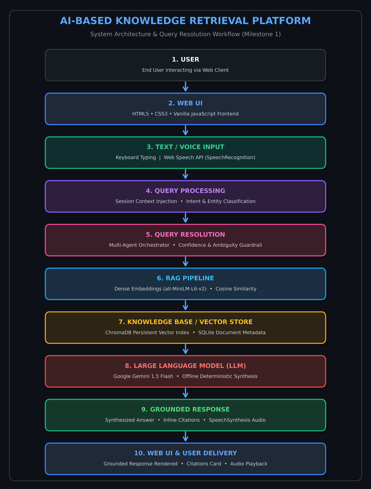

# AI-Based Knowledge Retrieval Platform with Query Resolution System

> ### 📌 Current Submission: Milestone 1
> **Infosys Springboard Internship Project**
> 
> *This repository is being developed as part of the Infosys internship project. The current submission focuses on **Milestone 1**, covering RAG architecture study, multi-agent query resolution patterns, Web Speech API integration, system architecture design, and data specifications. Further implementation activities will be completed in subsequent milestones.*

---

## 🎯 Project Overview

The **AI-Based Knowledge Retrieval Platform with Query Resolution System** is an enterprise-grade, full-stack knowledge retrieval solution designed to resolve user inquiries against internal documentation (PDF, DOCX, TXT, CSV). It combines **Retrieval-Augmented Generation (RAG)** with a **Multi-Agent Orchestration Pipeline** and **Multimodal Voice I/O (Web Speech API)** to deliver accurate, cited, and hallucination-free answers.

### 🌟 Milestone 1 Objectives
1. **RAG Architecture Study**: Thorough analysis of retrieval-augmented generation mechanics, chunking trade-offs, vector embedding models, and similarity search algorithms.
2. **Multi-Agent Query Resolution Patterns**: Design of specialized agent roles (Memory, Query Understanding, Retrieval, Clarification Guardrail, and Response Generation).
3. **Web Speech API Integration**: Specification and client implementation of browser-native speech recognition (voice-to-text) and speech synthesis (text-to-speech).
4. **System Architecture Design**: Formulation of an end-to-end multi-layer architecture with a formal graphical diagram.
5. **Data Specifications**: Comprehensive schemas covering input, processing, retrieved, and output data contracts.
6. **Frontend Prototype**: Delivery of a responsive, modern HTML5/CSS3/Vanilla JavaScript interface prototype.

---

## 📂 Repository Structure

The repository is organized with a dedicated `milestone-1/` directory alongside existing project assets:

```text
rag/
├── milestone-1/                                # Milestone 1 Submission Directory
│   ├── documentation/
│   │   ├── RAG-Architecture.md                 # RAG theory, chunking, embeddings, workflow
│   │   ├── Multi-Agent-Query-Resolution.md     # 5-Agent query resolution architecture & communication
│   │   ├── Web-Speech-API.md                   # SpeechRecognition & SpeechSynthesis integration
│   │   └── Data-Specifications.md              # Input, processing, retrieved, and output schemas
│   │
│   ├── architecture/
│   │   ├── System-Architecture.png             # High-resolution architectural workflow diagram
│   │   └── System-Architecture.md              # Detailed component & layer breakdown
│   │
│   └── frontend/
│       ├── index.html                          # Milestone 1 UI prototype with voice controls & dropzone
│       ├── style.css                           # Modern dark glassmorphic styling & responsive layout
│       └── script.js                           # Web Speech API, agent animation, and resolution logic
│
├── backend/                                    # Existing backend implementation
│   ├── app.py                                  # Flask REST API server
│   ├── requirements.txt                        # Python dependencies
│   ├── test_retrieval.py                       # Automated evaluation test suite
│   ├── .env.example                            # Environment variables template
│   ├── agents/                                 # Multi-agent implementations
│   │   ├── memory_agent.py                     # Multi-turn conversation memory
│   │   ├── query_agent.py                      # Query classifier & entity normalizer
│   │   ├── retrieval_agent.py                  # ChromaDB vector retrieval
│   │   ├── clarification_agent.py              # Confidence guardrail agent
│   │   ├── response_agent.py                   # Grounded answer synthesis agent
│   │   └── orchestrator.py                     # Pipeline coordinator
│   ├── utils/                                  # Text extraction, chunking, and embedding utilities
│   ├── sample_data/                            # Reference HR policies & product manuals
│   ├── uploads/                                # Ingested documents storage
│   └── vectorstore/                            # Persistent ChromaDB vector index
│
├── docs/                                       # Additional engineering documentation
├── frontend/                                   # Application frontend assets
└── README.md                                   # Root project documentation
```

---

## 📑 Milestone 1 Documentation Index

All primary Milestone 1 deliverables are located in the `milestone-1/` directory:

| Document | File Path | Focus Areas |
| :--- | :--- | :--- |
| **RAG Architecture Study** | [`milestone-1/documentation/RAG-Architecture.md`](milestone-1/documentation/RAG-Architecture.md) | Ingestion, text preprocessing, chunking (500 chars / 50 overlap), `all-MiniLM-L6-v2` embeddings, ChromaDB HNSW vector indexing, cosine similarity retrieval, context injection, and LLM response generation. |
| **Multi-Agent Query Resolution** | [`milestone-1/documentation/Multi-Agent-Query-Resolution.md`](milestone-1/documentation/Multi-Agent-Query-Resolution.md) | Proposed multi-agent architecture: Memory Agent, Query Understanding Agent, Retrieval Agent, Clarification Guardrail Agent (< 0.50 cutoff), and Response Agent with inter-agent state contracts. |
| **Web Speech API Integration** | [`milestone-1/documentation/Web-Speech-API.md`](milestone-1/documentation/Web-Speech-API.md) | Browser-native `SpeechRecognition` voice-to-text input, `SpeechSynthesis` voice output, audio sanitization, browser compatibility matrix, and UI interaction workflow. |
| **Data Specifications** | [`milestone-1/documentation/Data-Specifications.md`](milestone-1/documentation/Data-Specifications.md) | JSON schemas and specifications across 4 categories: Input Data (queries, uploads), Processing Data (metadata, chunks, 384-d vectors), Retrieved Data (matches, similarity), and Output Data (citations, telemetry). |
| **System Architecture Specification** | [`milestone-1/architecture/System-Architecture.md`](milestone-1/architecture/System-Architecture.md) | Layer-by-layer architectural explanation covering Client UI, Input Layer, Query Processing, Query Resolution, RAG Pipeline, Vector Store, LLM, and Response Delivery. |
| **System Architecture Diagram** | [`milestone-1/architecture/System-Architecture.png`](milestone-1/architecture/System-Architecture.png) | High-resolution diagram illustrating the complete end-to-end data flow from User input to Grounded Response. |
| **Frontend Prototype** | [`milestone-1/frontend/index.html`](milestone-1/frontend/index.html) | Standalone interactive UI prototype with drag-and-drop document upload, live agent execution pipeline bar, voice input/output controls, and citation cards. |

---

## 🏛️ System Architecture Workflow

```text
User
 ↓
Web UI
 ↓
Text / Voice Input
 ↓
Query Processing
 ↓
Query Resolution
 ↓
RAG Pipeline
 ↓
Knowledge Base / Vector Store
 ↓
LLM
 ↓
Response
 ↓
Web UI
```



---

## 💻 Technologies Used & Proposed

| Component | Technology | Rationale / Purpose |
| :--- | :--- | :--- |
| **Frontend Core** | **HTML5, CSS3, Vanilla JavaScript** | Lightweight, framework-free client ensures fast page loads and simple deployment without node build pipelines. |
| **Voice Interface** | **W3C Web Speech API** | Native in-browser speech recognition and audio synthesis without external cloud API costs or latency. |
| **Backend API** | **Python 3.9+ & Flask** | Modular REST API layer facilitating asynchronous request dispatching and multi-agent coordination. |
| **Vector Store** | **ChromaDB (HNSW Cosine Space)** | Embedded, disk-persistent vector database supporting high-throughput nearest neighbor search. |
| **Embedding Model** | **`all-MiniLM-L6-v2` (Sentence-Transformers)** | 384-dimensional dense vectors; executes fast locally on CPU with zero external API fees. |
| **Text Splitter** | **`RecursiveCharacterTextSplitter`** | Splits documents hierarchically on paragraph and sentence boundaries with 500-char size and 50-char overlap. |
| **Language Model** | **Google Gemini 1.5 Flash** | High-throughput, context-window-efficient model for grounded response synthesis; includes offline local synthesis fallback. |
| **Metadata DB** | **SQLite3** | Lightweight relational storage for document records, chunk counts, and multi-turn session history. |

---

## 🚀 How to Run & Verify the Project

### 1. View the Milestone 1 Frontend Prototype
The Milestone 1 prototype runs directly in any modern web browser (Chrome or Edge recommended for voice support):
- Open `milestone-1/frontend/index.html` in your browser.
- Try clicking the sample query chips (e.g. *Annual Leave Policy*, *Installation Steps*, *Edition Comparison*).
- Click the **Microphone** button to test speech recognition.
- Toggle **Voice Output** to hear synthesized speech.
- Drag and drop documents into the upload dropzone to test the ingestion UI.

### 2. Run the Automated Evaluation Suite
To verify the retrieval accuracy and clarification thresholding on sample datasets:

```bash
# Install dependencies
pip install -r backend/requirements.txt

# Execute retrieval evaluation
python backend/test_retrieval.py
```

**Evaluation Results Highlights:**
- **Top-1 Retrieval Accuracy**: `100.0%` (6/6 queries matched expected chunks)
- **Top-3 Retrieval Accuracy**: `100.0%` (6/6)
- **Top-5 Retrieval Accuracy**: `100.0%` (6/6)
- **Out-of-Domain Guardrail**: Irrelevant query scored `39.5%` similarity (< 0.50 threshold), successfully triggering the Clarification Agent.

### 3. Run the Full-Stack Backend (Optional)
To run the live Flask backend with ChromaDB persistence:

```bash
python backend/app.py
```
Then visit `http://localhost:5000` in your browser.

---

## 🔮 Future Milestone Roadmap

- **Milestone 2**: Full multi-agent orchestration enhancements, dynamic query decomposition into parallel sub-searches, and iterative re-ranking.
- **Milestone 3**: Advanced document parsing (scanned PDFs, OCR, tables), hybrid search (dense semantic + BM25 keyword), and citation highlighting.
- **Milestone 4**: Production deployment hardening, comprehensive unit/integration test suites, and Docker containerization.
