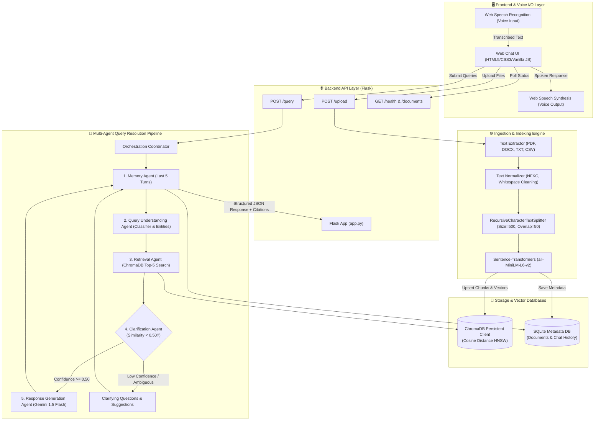

# Milestone 1.2: System Architecture & Data Specifications
## AI-Based Knowledge Retrieval Platform with Query Resolution System

---

## 1. End-to-End System Architecture Diagram



---

## 2. Ingestion & Retrieval Data Flow

### Ingestion Flow:
1. **File Received**: The user uploads a `.pdf`, `.docx`, `.txt`, or `.csv` file via `POST /upload`.
2. **Extraction & Sanitization**: [`extract_text.py`](file:///c:/Users/Gopika%20Sri/OneDrive/Desktop/rag/backend/utils/extract_text.py) parses raw file bytes, normalizes Unicode characters, and removes control characters.
3. **Text Splitting**: [`chunking.py`](file:///c:/Users/Gopika%20Sri/OneDrive/Desktop/rag/backend/utils/chunking.py) fragments the sanitized text into 500-token chunks with 50-token overlapping margins.
4. **Vector Encoding**: [`embeddings.py`](file:///c:/Users/Gopika%20Sri/OneDrive/Desktop/rag/backend/utils/embeddings.py) encodes chunk texts into 384-dimensional dense vectors using `all-MiniLM-L6-v2`.
5. **Persistence**: Chunks and vectors are upserted into `ChromaDB` (`hnsw:space = cosine`), and file metadata is saved to `rag_metadata.db`.

### Query Flow:
1. **User Interaction**: User inputs query via keyboard or voice-to-text.
2. **Context Resolution**: Memory Agent fetches prior session turns from SQLite.
3. **Intent Parsing**: Query Understanding Agent classifies the question type (`factual`, `procedural`, `comparative`) and isolates keywords.
4. **Vector Search**: Retrieval Agent embeds the query and queries ChromaDB for the Top-5 nearest neighbors.
5. **Confidence Guardrail**: Clarification Agent validates if Top-1 similarity $\ge 0.50$. If not, generates clarifying suggestions.
6. **LLM Generation**: Response Agent synthesizes the final grounded answer with inline citations (`[Source: filename]`).
7. **Delivery & Audio**: Frontend renders the response, displays citation cards, and invokes `SpeechSynthesis` to speak the answer.

---

## 3. Data Schema Definitions

### 1. Document Schema
```python
class DocumentMetadata:
    id: int                     # Database Primary Key
    filename: str               # e.g., "hr_policy.txt"
    file_path: str              # e.g., "backend/uploads/hr_policy.txt"
    file_type: str              # e.g., ".txt", ".pdf", ".docx", ".csv"
    file_size: int              # Size in bytes
    chunks_count: int           # Total number of generated chunks
    uploaded_at: str            # ISO-8601 Timestamp
```

### 2. Chunk Schema
```python
class Chunk:
    id: str                     # e.g., "hr_policy.txt_chunk_0"
    text: str                   # Extracted chunk content (max 500 characters)
    metadata: {
        "chunk_id": str,        # Unique chunk identifier
        "source": str,          # Source filename
        "chunk_index": int,     # 0-indexed position within document
        "total_chunks": int,    # Total chunks in parent document
        "char_count": int,      # Character length of this chunk
        "timestamp": str,       # Creation timestamp
        "file_type": str,       # Original document format
        "file_size": int        # Original file size in bytes
    }
```

### 3. Embedding Vector Schema
```python
class EmbeddingVector:
    id: str                     # Matches Chunk.id
    vector: List[float]         # 384-dimensional float vector (L2 normalized)
    document: str               # Original chunk text
    metadata: dict              # Chunk metadata dict
```

### 4. Query Request Schema
```python
class QueryRequest:
    query: str                  # User query string (Voice/Text)
    session_id: Optional[str]   # Session ID (defaults to auto-generated UUID)
```

### 5. Retrieval Result Schema
```python
class RetrievalResult:
    id: str                     # Chunk ID
    text: str                   # Chunk text content
    metadata: dict              # Chunk metadata
    distance: float             # Cosine distance (0.0 = identical, 2.0 = opposite)
    similarity: float           # Cosine similarity score (1.0 - distance, range [0, 1])
```

### 6. Agent Response Schema
```python
class AgentQueryResponse:
    query: str                  # Original user query
    query_type: str             # "factual" | "procedural" | "comparative"
    response: str               # Synthesized answer or clarifying question
    is_clarification: bool      # True if confidence was below threshold
    confidence_score: float     # Highest similarity score (0.0 to 1.0)
    engine: str                 # "Gemini (gemini-1.5-flash)" or "Local Synthesis"
    session_id: str             # Session identifier
    citations: List[{
        "source_index": int,    # 1-indexed citation number
        "source_file": str,     # Source filename
        "chunk_id": str,        # Chunk ID cited
        "similarity_score": float, # Match similarity (e.g., 0.854)
        "excerpt": str          # Context excerpt preview
    }]
    agent_pipeline_steps: List[{
        "step": int,            # Step number (1 through 5)
        "agent": str,           # Agent name
        "action": str,          # Action description
        "details": Any          # Step execution telemetry
    }]
```
