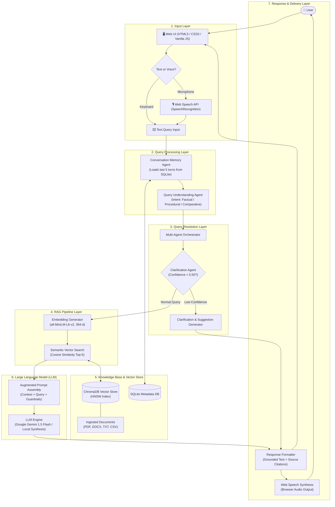

# Milestone 1: System Architecture

## AI-Based Knowledge Retrieval Platform with Query Resolution System

---

## 1. High-Level Architecture Flow

The system architecture diagram illustrates the end-to-end data and query flow across client, application, and persistence layers:

```
+-------------------------------------------------------------------------+
|                                  USER                                   |
+-------------------------------------------------------------------------+
                                     │
                                     ▼
+-------------------------------------------------------------------------+
|                        WEB USER INTERFACE (UI)                          |
|         (HTML5, CSS3, Vanilla JavaScript, Glassmorphic Design)          |
+-------------------------------------------------------------------------+
                                     │
                                     ▼
+-------------------------------------------------------------------------+
|                          TEXT / VOICE INPUT                             |
|  (Keyboard Text Entry  •  Web Speech Recognition Audio Transcription)   |
+-------------------------------------------------------------------------+
                                     │
                                     ▼
+-------------------------------------------------------------------------+
|                            QUERY PROCESSING                             |
|       (Session Context Loading  •  Intent & Entity Classification)      |
+-------------------------------------------------------------------------+
                                     │
                                     ▼
+-------------------------------------------------------------------------+
|                            QUERY RESOLUTION                             |
|       (Multi-Agent Decomposition  •  Confidence & Ambiguity Guard)      |
+-------------------------------------------------------------------------+
                                     │
                                     ▼
+-------------------------------------------------------------------------+
|                              RAG PIPELINE                               |
|        (Sentence-Transformers Embeddings  •  Cosine Similarity)         |
+-------------------------------------------------------------------------+
                                     │
                                     ▼
+-------------------------------------------------------------------------+
|                     KNOWLEDGE BASE / VECTOR STORE                       |
|           (ChromaDB HNSW Persistent Store  •  SQLite Metadata)          |
+-------------------------------------------------------------------------+
                                     │
                                     ▼
+-------------------------------------------------------------------------+
|                       LARGE LANGUAGE MODEL (LLM)                        |
|       (Google Gemini 1.5 Flash  •  Fallback Local Synthesis Engine)     |
+-------------------------------------------------------------------------+
                                     │
                                     ▼
+-------------------------------------------------------------------------+
|                                RESPONSE                                 |
|      (Grounded Answer  •  Source Citations  •  Speech Synthesis Audio)  |
+-------------------------------------------------------------------------+
                                     │
                                     ▼
+-------------------------------------------------------------------------+
|                        WEB USER INTERFACE (UI)                          |
|         (Rendered Message Bubble  •  Citations Card  •  Audio Playback) |
+-------------------------------------------------------------------------+
```

A graphical diagram is saved as [`System-Architecture.png`](System-Architecture.png).

---

## 2. Mermaid Workflow Architecture



---

## 3. Detailed Component Explanations

### 1. Web UI Layer
- **Technology**: Built using HTML5, CSS3, and modern Vanilla JavaScript without bloated heavy frameworks.
- **Design Paradigm**: Dark glassmorphic user interface featuring glowing neon accents, card blur effects, animated telemetry pipeline indicators, drag-and-drop document upload, and responsive viewport sizing.
- **Interactive Elements**:
  - Live agent telemetry bar tracking multi-agent execution steps.
  - Document management sidebar with real-time status of indexed files.
  - Interactive citation badges linking answers directly to source documents.

### 2. Text / Voice Input Layer
- **Dual Multimodal Input**:
  - **Text Input**: Flexible multi-line auto-expanding textarea supporting Enter to submit and Shift+Enter for newline.
  - **Voice Input**: Powered by the native browser W3C Web Speech API (`SpeechRecognition` / `webkitSpeechRecognition`). Captures microphone audio, displays continuous transcriptions in the input box, and submits automatically on natural pause.

### 3. Query Processing Layer
- **Session Memory**: Injects previous conversational turns so the system understands context references and pronoun substitutions.
- **Query Classification**: Identifies question intent (`factual`, `procedural`, `comparative`, `out-of-domain`) and performs keyword extraction to maximize retrieval precision.

### 4. Query Resolution Layer
- **Multi-Agent Orchestration**: Coordinates state flow between isolated agent modules.
- **Confidence Guardrail**: Clarification Agent calculates cosine similarity against indexed knowledge. If relevance is below $0.50$, it halts generation and prompts the user for clarification, eliminating hallucinations.

### 5. RAG Pipeline Layer
- **Embedding Generation**: Transforms incoming normalized queries into dense 384-dimensional vector embeddings via `sentence-transformers/all-MiniLM-L6-v2`.
- **Top-$k$ Retrieval**: Queries ChromaDB for the 5 most semantically similar passages using cosine distance metrics.

### 6. Knowledge Base / Vector Store
- **ChromaDB**: High-performance, embedded vector database utilizing Hierarchical Navigable Small World (HNSW) indexing for sub-millisecond approximate nearest neighbor retrieval.
- **SQLite Database (`rag_metadata.db`)**: Stores document metadata (filename, path, chunk count, file size, timestamps) and user chat session history.

### 7. Large Language Model (LLM)
- **Primary Generator**: Google Gemini 1.5 Flash via REST API, optimized for high throughput, fast response times, and strict adherence to context-grounded system prompts.
- **Offline Fallback**: Deterministic local synthesis engine that structures retrieved passages when external API connectivity is unavailable.

### 8. Response & Delivery Layer
- **Structured Payload**: Formats answers with inline citation indices matching source chunks.
- **Speech Synthesis (TTS)**: Translates response text into natural voice audio via the Web Speech API (`speechSynthesis`).
- **Telemetry Tracking**: Delivers execution step telemetry back to the UI for transparent multi-agent observability.
