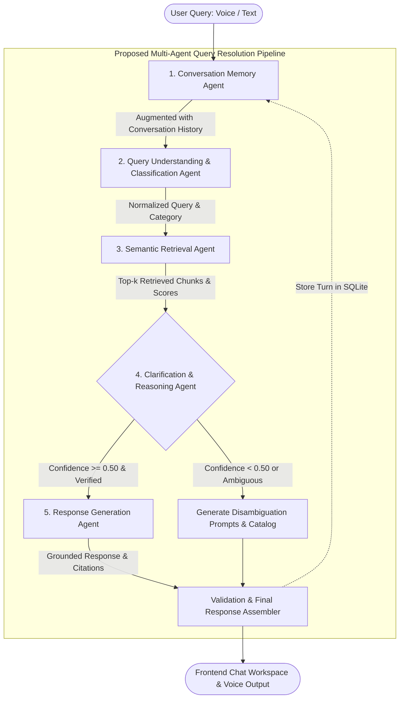

# Milestone 1: Multi-Agent Query Resolution Patterns

## AI-Based Knowledge Retrieval Platform with Query Resolution System

> **Status Notice**: This document outlines the **proposed architecture and design for Milestone 1**. It specifies the multi-agent orchestration pattern, agent responsibilities, inter-agent communication, and query resolution pipeline designed for the platform.

---

## 1. Introduction

Monolithic Large Language Model applications typically attempt to solve query classification, context retrieval, reasoning, hallucination detection, and response generation inside a single prompt call. While this works for trivial queries, it frequently degrades on complex enterprise queries that require:
- Multi-step reasoning or comparative evaluation across documents.
- Disambiguation of vague or underspecified inquiries.
- Maintaining multi-turn conversation state.
- Guardrailing against out-of-domain hallucinations.

To address these challenges, this project adopts a **Multi-Agent Query Resolution Architecture**. By decomposing query resolution into specialized, cooperative agents, each agent performs a targeted role with verifiable inputs and outputs.

---

## 2. Multi-Agent Pipeline Overview

The proposed query resolution architecture consists of five coordinated agents:



---

## 3. Individual Agent Roles & Mechanics

### 3.1 Agent 1: Conversation Memory Agent
- **Primary Function**: Manages session state, multi-turn history, and conversational context.
- **Workflow**:
  1. Retrieves the last $N$ turns (default: 5 turns) for the active `session_id` from persistent SQLite storage.
  2. Resolves conversational anaphora and pronouns (e.g., if a user asks *"What is the leave policy?"* followed by *"How do I apply for it?"*, the Memory Agent supplies the referent *"it = annual leave policy"*).
  3. Records the final resolved query-response pair back to the database upon completion.

### 3.2 Agent 2: Query Understanding & Classification Agent
- **Primary Function**: Syntactic and semantic analysis of incoming user queries.
- **Key Responsibilities**:
  1. **Query Classification**: Classifies queries into discrete categories:
     - **Factual**: Direct lookups of specific policies, limits, dates, or settings (*"What is the annual leave allowance?"*).
     - **Procedural**: Multi-step instructions, workflows, or setup guides (*"How do I install CloudSync Pro on Linux?"*).
     - **Comparative**: Comparative evaluation between two entities or tiers (*"Compare Standard edition vs Pro edition"*).
     - **Out-of-Domain / Ambiguous**: Inquiries that lack clarity or do not pertain to indexed knowledge.
  2. **Query Decomposition**: Breaks down complex compound questions into atomic sub-questions for individual vector searches.
  3. **Keyword Normalization**: Extracts core entities and cleans filler terms to maximize vector retrieval precision.

### 3.3 Agent 3: Semantic Retrieval Agent
- **Primary Function**: Vector space querying and relevant passage identification.
- **Key Responsibilities**:
  1. Translates normalized query text into dense 384-dimensional embeddings via `sentence-transformers/all-MiniLM-L6-v2`.
  2. Executes approximate nearest neighbor search (HNSW Cosine) against ChromaDB.
  3. Collects the Top-$k$ ($k=5$) chunks.
  4. Computes individual similarity percentages, ranks results, and calculates the overall confidence metric.

### 3.4 Agent 4: Clarification & Reasoning Agent
- **Primary Function**: Confidence guardrail, ambiguity resolution, and factual grounding check.
- **Key Responsibilities**:
  1. **Threshold Evaluation**: Checks if the Top-1 chunk similarity exceeds the confidence threshold ($\tau = 0.50$):
     - **High Confidence ($\ge 0.50$)**: Passes retrieved passages directly to the Response Generation Agent.
     - **Low Confidence ($< 0.50$)**: Intercepts the pipeline. Instead of allowing the LLM to hallucinate an answer, it produces clarifying prompts, suggests relevant topics based on indexed documents, and asks the user to rephrase.
  2. **Contradiction Resolution**: Inspects multi-chunk context for conflicting information before passing to the generator.

### 3.5 Agent 5: Response Generation Agent
- **Primary Function**: Synthesis of natural, grounded, well-structured answers.
- **Key Responsibilities**:
  1. Injects retrieved context passages and the user query into the system prompt.
  2. Enforces strict factual constraints: instructions forbid introducing external unverified knowledge.
  3. Employs Google Gemini 1.5 Flash (or deterministic local synthesis if running offline).
  4. Generates inline source markers linking statements to source chunks (e.g., `[Source: hr_policy.txt, Chunk: hr_policy.txt_chunk_3]`).

---

## 4. Agent Communication & Coordination Pattern

In this architecture, agents communicate via a **Sequential Pipeline with Shared State Context**.

### Communication Object: `AgentState`
Each query execution instantiates a shared state dictionary that flows between agents:

```python
{
    "session_id": "uuid-v4-string",
    "raw_query": "How do I configure SSL on CloudSync Pro?",
    "history": [...],                   # Filled by Memory Agent
    "classified_intent": "procedural",  # Filled by Query Understanding Agent
    "search_keywords": ["configure", "SSL", "CloudSync Pro"],
    "retrieved_chunks": [...],          # Filled by Retrieval Agent
    "top_similarity": 0.884,            # Filled by Retrieval Agent
    "requires_clarification": False,    # Evaluated by Clarification Agent
    "response_text": "...",             # Synthesized by Response Agent
    "citations": [...],                 # Extracted source references
    "execution_telemetry": [...]        # Step-by-step audit log
}
```

This pattern ensures:
- Loose coupling: Each agent is isolated and testable independently.
- Complete auditability: Every step records timing, decisions, and intermediate values.
- Seamless fallback: If any step flags an exception or low confidence, the pipeline routes to safe defaults.

---

## 5. Why Multi-Agent Architecture is Essential for Complex Queries

| Feature | Single-Prompt Architecture | Proposed Multi-Agent Architecture |
| :--- | :--- | :--- |
| **Ambiguity Handling** | Tries to guess user intent, often resulting in plausible falsehoods. | Clarification Agent explicitly identifies low confidence and asks clarifying questions. |
| **Multi-Turn Context** | Often loses conversation thread or mixes up previous references. | Memory Agent actively resolves pronouns and tracks dialogue state. |
| **Query Complexity** | Single prompt degrades when a query asks for multiple pieces of information. | Query Understanding Agent decomposes compound questions into discrete searches. |
| **Auditability & Observability** | Black-box output with no visibility into intermediate decisions. | Telemetry logs trace each agent's execution time, score, and decision tree. |
| **Reliability** | Susceptible to prompt injection or model drifting. | Separation of retrieval from generation enforces strict factual verification boundaries. |

---

## 6. Milestone 1 Status & Roadmap

- **Milestone 1 (Current)**:
  - Theoretical specification of agent responsibilities.
  - Definition of agent communication schemas.
  - Working baseline implementation of the 5-agent sequential orchestrator.
  - Evaluation of retrieval confidence thresholds against test queries.
- **Subsequent Milestones (Future Work)**:
  - Dynamic parallel sub-query retrieval.
  - Self-reflection agent loops for iterative re-ranking.
  - Integration of tool-calling agents for dynamic external API queries.
