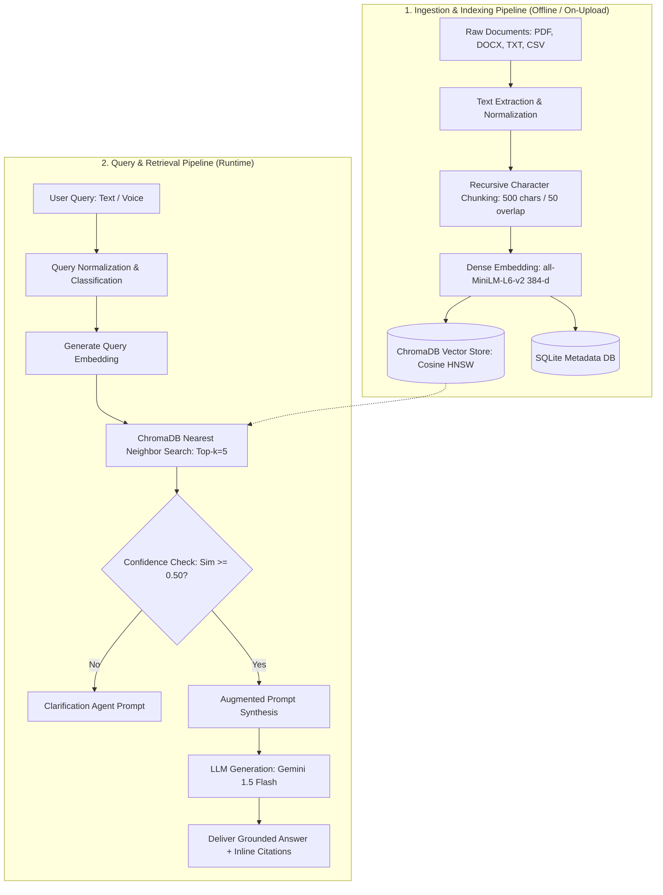

# Milestone 1: Retrieval-Augmented Generation (RAG) Architecture

## AI-Based Knowledge Retrieval Platform with Query Resolution System

---

## 1. Executive Summary

This document provides a detailed study and specification of the **Retrieval-Augmented Generation (RAG)** architecture designed for the *AI-Based Knowledge Retrieval Platform with Query Resolution System*. RAG is an AI framework that connects external knowledge sources to Large Language Models (LLMs), ensuring that answers provided to users are accurate, grounded, verifiable, and free from typical model hallucinations.

---

## 2. What is RAG?

Retrieval-Augmented Generation (RAG) is a hybrid architectural pattern combining two core pillars of modern artificial intelligence:

1. **Information Retrieval (IR)**: High-speed semantic search mechanisms that query external, dynamic knowledge bases (such as vector databases indexing enterprise files).
2. **Generative Language Models (LLMs)**: Natural language processing systems that understand context, synthesize answers, and produce fluent human responses.

In a traditional LLM interaction, the model answers queries purely from the weights acquired during its pre-training phase. In contrast, RAG intercepts the user query, retrieves the most relevant passages from indexed documents, and injects those excerpts into the model prompt as reference material at query time.

```
+------------------+         +-----------------------+         +---------------------+
| User Query       | ------> | Vector Search Over    | ------> | Context Injected    |
| (Text or Voice)  |         | Document Embeddings   |         | into System Prompt  |
+------------------+         +-----------------------+         +---------------------+
                                                                          |
                                                                          v
                                                              +-----------------------+
                                                              | Grounded Response     |
                                                              | with Source Citations |
                                                              +-----------------------+
```

---

## 3. Why RAG is Used in This Project

Pure Large Language Models suffer from key architectural constraints that make them unsuitable for proprietary enterprise document question-answering:

| Limitation of Pure LLMs | How RAG Solves It |
| :--- | :--- |
| **Hallucinations**: LLMs generate confident but incorrect facts when uncertain. | Answers are strictly restricted to facts contained within the retrieved source chunks. |
| **Knowledge Cutoff**: Pre-trained LLMs do not know events or data after their training date. | External knowledge can be updated continuously simply by indexing new files. |
| **Lack of Private Data Access**: Base LLMs have no access to internal HR policies, technical manuals, or company wikis. | Enterprise documents (PDF, DOCX, TXT, CSV) are indexed locally and securely. |
| **Lack of Traceability**: Pure LLMs cannot cite where a particular sentence originated. | Every answer includes source filename, chunk ID, and similarity percentage. |
| **Cost & Latency of Fine-Tuning**: Retraining models on new documents is computationally expensive. | RAG allows instant indexing and querying without fine-tuning model parameters. |

---

## 4. Complete RAG Pipeline Workflow

The platform follows a modular 8-stage pipeline:



---

## 5. Detailed Component Breakdown

### 5.1 Document Ingestion
The ingestion module accepts heterogeneous file formats commonly found in enterprise environments:
- **PDF Documents (`.pdf`)**: Parsed page-by-page using `pypdf`, extracting clean text streams while preserving paragraph breaks.
- **Word Documents (`.docx`)**: Parsed using `python-docx`, traversing paragraph structures, headings, and bullet points.
- **Plain Text (`.txt`)**: Read with UTF-8 encoding support and BOM handling.
- **Tabular Data (`.csv`)**: Row-by-row structural string formatting to preserve column-value relationships.

### 5.2 Text Preprocessing & Cleaning
Extracted raw text undergoes normalization:
1. **Unicode Normalization**: Canonical decomposition followed by canonical composition (NFKC) to resolve formatting anomalies.
2. **Whitespace Normalization**: Replacing non-standard spaces, tab sequences, and repeated empty lines with single line breaks.
3. **Control Character Stripping**: Removal of non-printable ASCII/Unicode control characters to prevent tokenization artifacts.

### 5.3 Chunking Strategy & Rationalization
Chunking is the process of breaking long unstructured documents into smaller, semantically coherent units.

- **Splitter**: `RecursiveCharacterTextSplitter` (LangChain-based pattern).
- **Chunk Size**: `500` characters.
- **Chunk Overlap**: `50` characters ($10\%$ overlap ratio).
- **Separators**: `["\n\n", "\n", ". ", "? ", "! ", " ", ""]` (prioritizing natural paragraph and sentence boundaries).

#### Rationale for Chunking Parameters:
1. **Granularity**: A 500-character chunk encapsulates 2 to 4 full sentences, ideal for capturing discrete policy rules, installation commands, or parameter tables without diluting semantics.
2. **Context Window Optimization**: Top-5 retrieved chunks total ~2,500 characters (~600 tokens), remaining well within LLM context windows while keeping latency minimal.
3. **Boundary Continuity**: A 50-character overlap prevents critical conditional phrases (e.g., *"Provided that notice is submitted 30 days prior..."*) from being severed at chunk boundaries.

### 5.4 Dense Embeddings
Text chunks are converted into dense vector representations using **`sentence-transformers/all-MiniLM-L6-v2`**:
- **Dimensions**: 384 dimensions.
- **Input Limit**: 256 tokens.
- **Metric**: Cosine similarity ($1.0 - \text{cosine distance}$).
- **Key Advantage**: Operates locally on CPU with zero API costs, encoding thousands of words per second with high semantic density.

### 5.5 Vector Database & Vector Search
The system utilizes **ChromaDB**, an open-source, embeddable vector database:
- **Index Type**: Hierarchical Navigable Small World (HNSW) graphs.
- **Distance Function**: Cosine space (`hnsw:space = "cosine"`).
- **Persistence**: File-backed storage on disk, enabling fast instant lookup across sessions without rebuilding indexes on restart.

### 5.6 Semantic Retrieval
When a query arrives:
1. The user query is converted into a 384-dimensional vector using the same embedding model.
2. ChromaDB evaluates the cosine distance between the query vector and all indexed chunk vectors:
   $$\text{Cosine Distance}(u, v) = 1 - \frac{u \cdot v}{\|u\| \|v\|}$$
   $$\text{Similarity Score} = 1.0 - \text{Cosine Distance}$$
3. The top $k$ ($k=5$) chunks with the highest similarity scores are retrieved along with their source metadata.

### 5.7 Context Generation & Prompt Engineering
The retrieved chunks are assembled into a structured context block injected into the LLM system prompt:

```text
You are a factual knowledge assistant. Answer the user's question using ONLY the retrieved context below.
If the context does not contain sufficient information, state clearly that the answer is not available in the documents.
Always cite your sources using [Source: filename, Chunk: chunk_id].

--- RETRIEVED CONTEXT ---
[Source: hr_policy.txt, Chunk: hr_policy.txt_chunk_3, Relevance: 88.5%]
Full-time employees accrue 20 days of paid annual leave per calendar year...
-------------------------

User Question: How much annual leave do employees receive?
```

### 5.8 LLM Response Generation & Grounding
- **Engine**: Google Gemini API (`gemini-1.5-flash`) for fast, natural response synthesis with strong instruction-following capabilities.
- **Fallback / Local Synthesis**: When an API key is not configured, the platform includes a deterministic local synthesis engine that formats the retrieved excerpts directly.
- **Citation Attribution**: Every factual claim is mapped back to the exact chunk ID and source filename, providing full auditability for enterprise compliance.

---

## 6. Milestone 1 Deliverables Summary

For Milestone 1, the RAG architecture foundation has been designed, validated with sample corporate datasets (HR policies and CloudSync Pro technical manual), achieving 100% Top-1 retrieval accuracy across factual, procedural, and comparative test suites.
