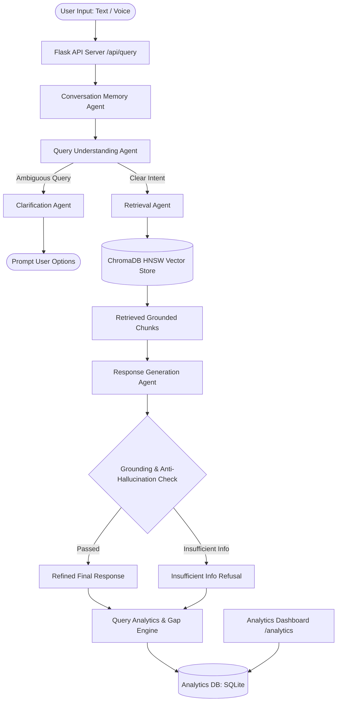

# Milestone 4 System Architecture & Technical Specification

## 1. System Overview
The **AI-Based Knowledge Retrieval Platform with Query Resolution System** is an enterprise-grade Multi-Agent Retrieval-Augmented Generation (RAG) platform. It provides accurate, transparent, and grounded query resolution across specialized knowledge domains, backed by an integrated **Query Analytics & Knowledge Gap Detection System**.

---

## 2. Core Architectural Components

### 2.1 Multi-Agent Pipeline Layer
1. **Conversation Memory Agent (`milestone-3/agents/conversation_memory_agent.py`)**
   - Manages session state, conversation history, entity references, and topic continuity.
   - Enables multi-turn contextual reasoning (e.g., resolving pronouns across turns).

2. **Query Understanding Agent (`milestone-2/agents/query_understanding_agent.py`)**
   - Classifies query intent: `factual`, `procedural`, `comparative`, `ambiguous`, or `out_of_scope`.
   - Extracts key entities, technical keywords, and topic tags.
   - Infers knowledge domain (`AI/ML`, `Cloud Computing`, `Cybersecurity`, `HR & Policy`).

3. **Clarification Agent (`milestone-3/agents/clarification_agent.py`)**
   - Detects ambiguous or under-specified queries.
   - Generates structured clarification questions with selectable options to resolve user intent before retrieval.

4. **Retrieval Agent (`milestone-2/agents/retrieval_agent.py` & `retrieval/vector_store.py`)**
   - Performs dense semantic search against ChromaDB HNSW vector index.
   - Employs cosine similarity with metadata filtering across knowledge domain collections.
   - Extracts source citations and file references.

5. **Response Generation Agent (`milestone-2/agents/response_generation_agent.py`)**
   - Generates grounded, hallucination-free answers strictly conditioned on retrieved context chunks.
   - Enforces strict confidence scoring:
     - `High (≥ 0.60)`: Direct reliable factual resolution.
     - `Medium (0.30 - 0.59)`: Qualified answer with confidence warning.
     - `Low (< 0.30)`: Refusal message ("Sufficient information was not found in the knowledge base...").

6. **Transparency & Telemetry Agent (`milestone-3/transparency/`)**
   - Captures detailed execution traces, step timings, classification scores, and vector distances for user inspection.

7. **Query Analytics & Knowledge Gap Detection Engine (`milestone-4/analytics/query_analytics.py`)**
   - Persists all query execution logs in SQLite (`milestone-4/data/analytics.db`).
   - Automatically detects missing knowledge topics by clustering low-confidence/unanswered queries.
   - Serves metrics to the web-based Analytics Dashboard.

---

## 3. Data Flow & Database Architecture

### 3.1 Vector Store (ChromaDB)
- **Engine**: ChromaDB Persistent Client with HNSW index (Cosine distance).
- **Embeddings**: `all-MiniLM-L6-v2` / Google Generative AI embeddings.
- **Chunking Strategy**: 500 characters with 50 character overlap (sliding window).

### 3.2 Analytics Database (SQLite)
- **Path**: `milestone-4/data/analytics.db`
- **Schema**:
  - `id` (INTEGER PRIMARY KEY)
  - `query_text` (TEXT)
  - `session_id` (TEXT)
  - `domain` (TEXT)
  - `query_type` (TEXT)
  - `confidence_score` (REAL)
  - `confidence_level` (TEXT)
  - `status` (TEXT: `answered`, `knowledge_gap`, `clarification_needed`)
  - `retrieved_docs` (TEXT)
  - `timestamp` (DATETIME)

---

## 4. Multi-Domain Knowledge Base
Milestone 4 expands system knowledge across 3 core technical domains + HR policies:
1. **AI / Machine Learning**: Supervised/Unsupervised learning, Deep Learning, Transformer models, LLMs, RAG, Fine-tuning, Vector Embeddings.
2. **Cloud Computing**: IaaS/PaaS/SaaS architectures, Multi-cloud/Hybrid deployment, Object storage, CDN, Serverless computing, Cost optimization.
3. **Cybersecurity**: CIA Triad, AES-256/RSA Encryption, Firewalls, WAF, Zero Trust Architecture, NIST Incident Response Lifecycle, SIEM/SOC, Pen testing.
4. **HR & Policy**: Employee guidelines, leave policies, code of conduct, remote work rules.

---

## 5. Security & Deployment Architecture
- **API Framework**: Flask REST server on port 5000 with CORS protection and Permissions-Policy header for microphone audio capture.
- **Privacy & Grounding**: No external data leakage; LLM prompts strictly isolated with zero-shot grounding rules.
- **Voice Support**: Integrated Web Speech API (`en-IN` voice locale optimization) and Web Speech Synthesis.
